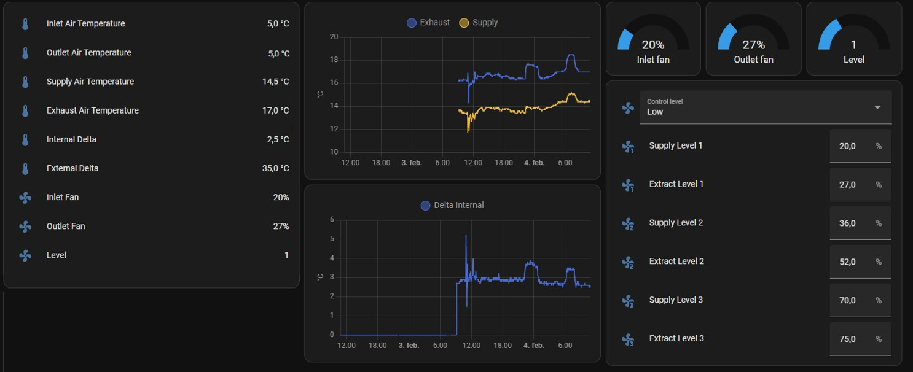

# Genvex Controller based on ESPHome Integration for Home Assistant

## Overview

This ESPHome configuration allows Home Assistant to monitor and control a Genvex heat recovery ventilation system via UART communication with an ESP32. It replaces the Optima controller and communicates directly with the Genvex ventilation system using TX, RX, GND, and 10V.

## Features

- **Read temperature values:** Supply, exhaust, inlet, and outlet.
- **Monitor fan speeds** and control ventilation levels.
- **Adjust fan speed** for different levels.
- **Select control modes:** Low, Medium, High, and Off.

## Home Assistant Entities

### Sensors

- **Inlet Air Temperature** (`inlet_air_temperature`) - Measures incoming air temperature.
- **Outlet Air Temperature** (`outlet_air_temperature`) - Measures outgoing air temperature.
- **Exhaust Air Temperature** (`exhaust_air_temperature`) - Measures air being exhausted.
- **Supply Air Temperature** (`supply_air_temperature`) - Measures air supplied into the house.
- **Internal Temperature Delta** - Difference between exhaust and supply air.
- **External Temperature Delta** - Difference between inlet and outlet air.
- **WiFi Signal Strength** - Monitors the ESP32’s connection strength.

### Fan Speed Sensors

- **Inlet Fan Speed** - Monitors the intake fan speed.
- **Outlet Fan Speed** - Monitors the exhaust fan speed.
- **Level** - Displays the current ventilation level.

### Controls

#### Fan Speed Adjustment (Number Entities)

- **Level 1, 2, 3 Supply & Extract** - Allows setting fan speed percentages for different levels.

#### Control Mode Selection (Select Entity)

- **Control Level** - Allows selecting ventilation modes (Low, Medium, High, Off).

## Usage

These entities appear in Home Assistant, enabling real-time monitoring and control of your Genvex system via ESPHome.

